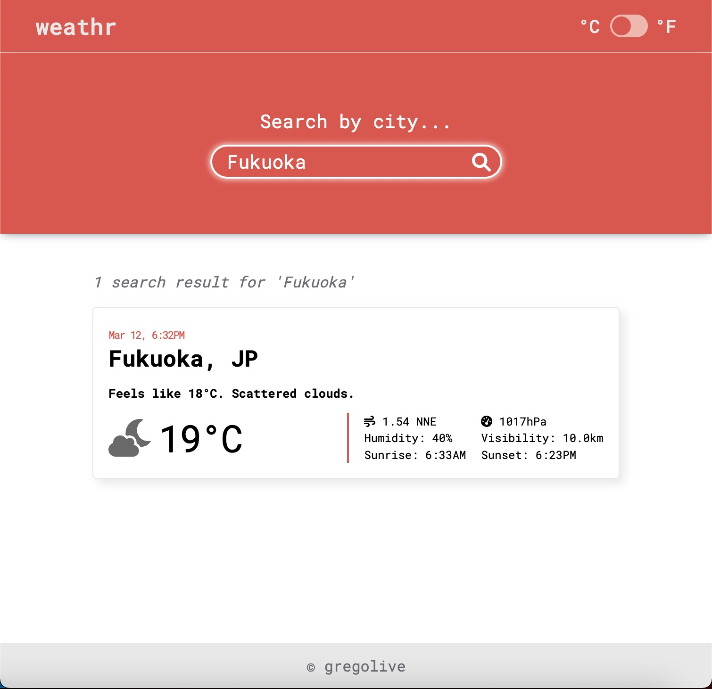

# Weathr

Search for realtime weather info in your city.

[Live demo](https://gregolive.github.io/weather-app/) 👈

## Functionality

- Enter a city name in the search form and submit to find realtime weather at that location
- A toggle in the navbar allows the user to display temperatures in either Celcius or Fahrenheit
- Fetch weather information via the Openweathermap API
- Javascript's <code>async</code> and <code>await</code> Promise keyword's were alongside the <code>fetch</code> function to asynchronously obtain the weather data
- Display location's name, current local time, temperature, feels like temperature, weather (clear, scattered clouds, heavy rain, etc.), weather icon, wind (speed and direction), pressure, humidity, visibility, and local sunrise and sunset times
- Weather icons come via fontawesome's icon pack and the colors change depending on weather and times of day (day or night)


## Reflection

The Openweathermap API has good documentation and that made querying weather data straight forward. The main issue with the current implementation is that the API key is hard coded into the query function and visible. For a project being pushed to production this would not be acceptable and Git Guardian was quick to alert me when I pushed to Github.

The weather data is queried with an <code>async</code> function and the <code>await</code> keyword ensures that the function 'pauses' until a response is returned by the <code>fetch</code>. The response is then processed with Javascript's <code>.json()</code> function.

````
const queryWeatherData = async (query) => {
  const response = await fetch(URL, { mode: 'cors' });
  return response.json();
};
````

To me this async/await implementation is more intuitive than the typical Promise structure and allowed me to wrap my head around error tracing more easily.

## Screenshot


